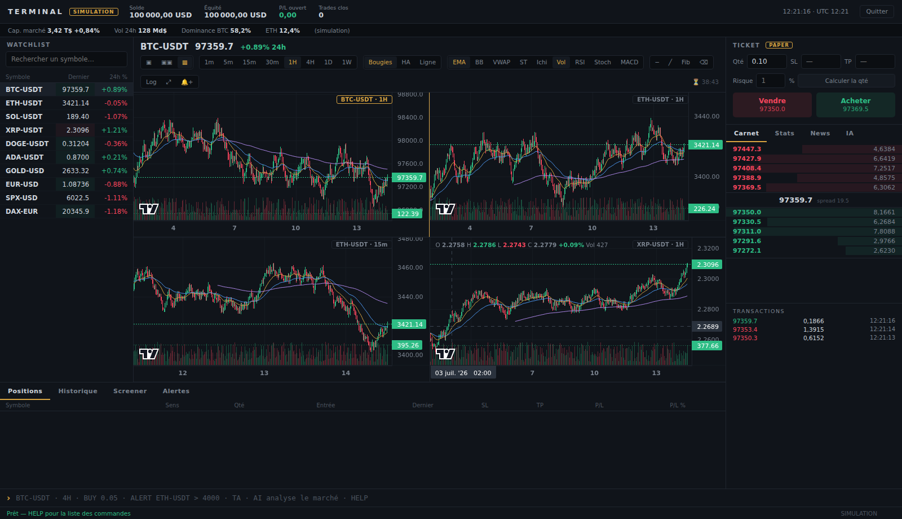

# Terminal — poste de trading multi-courtiers

Terminal web professionnel (non officiel) : données de marché temps réel,
graphiques de niveau TradingView, carnet d'ordres, statistiques avancées,
paper trading et analyste IA — le tout **sans backend** : le navigateur parle
directement aux API officielles.



## Courtiers / sources de données

| Source | Données | Trading | Identifiants |
|--------|---------|---------|--------------|
| **OKX** | Crypto spot temps réel (WebSocket public, repli REST auto) | Paper trading (100 000 USDT fictifs, prix réels) | Aucun |
| **XTB** | CFD Forex / indices / matières premières (xAPI) | **Réel** sur votre compte démo ou réel | N° de compte + mot de passe xStation |
| **Simulation** | Marche aléatoire locale | Paper trading | Aucun |

## Fonctionnalités

**Graphiques** — moteur [TradingView Lightweight Charts™](https://github.com/tradingview/lightweight-charts)
(open source, Apache-2.0), en **disposition 1 / 2 / 4 graphiques synchronisés**
(chaque cellule son instrument et son unité de temps) : chandeliers /
Heikin-Ashi / ligne, volume, EMA 20-50-200, Bollinger, VWAP session,
**SuperTrend, Ichimoku**, RSI, **Stochastique** et MACD en sous-panneaux,
échelle log, axe en heure locale, zoom/pan fluides, crosshair avec légende
OHLC, lignes de prix positions (entrée/SL/TP) et alertes. **Outils de dessin**
(horizontale, tendance, Fibonacci) persistés par instrument. Chargement
infini de l'historique. Bandeau **marché global** (cap., dominance BTC/ETH).

**Marché** — carnet d'ordres 5 niveaux avec barres de profondeur, flux des
transactions, statistiques : variation/volumes 24h, **funding rate, open
interest, prix d'index** (dérivés OKX), ATR 14, volatilité par bougie,
spread/swap/levier (CFD XTB). Recherche instantanée parmi tous les
instruments OKX.

**Trading** — ticket achat/vente au marché avec SL/TP, confirmation
systématique, notionnel affiché. Paper trading exécuté aux prix réels avec
**SL/TP déclenchés automatiquement**, historique persistant et statistiques
de portefeuille (taux de réussite, profit factor, gain/perte moyens).
En mode XTB : ordres réels sur votre compte.

**Alertes de prix** — toast + notification navigateur + ligne sur le
graphique, persistées localement.

**IA** — rapport d'analyse technique local (score composite, verdict,
niveaux pivots — fonctionne sans clé) + chat Claude avec contexte marché
complet (prix, indicateurs, carnet, funding, positions, compte) envoyé
**directement du navigateur** à l'API Anthropic. Boutons : Analyse, Risque,
Plan de trade. Clé stockée en localStorage (`KEY`).

**News** — annonces officielles OKX / flux news XTB selon la source.

## Démarrage

Site statique, aucune dépendance :

```bash
python3 -m http.server 8000   # puis http://localhost:8000
```

ou ouvrez directement la version en ligne, choisissez **OKX** et lancez —
aucun compte requis.

## Ligne de commande (`/` pour focaliser, ↑↓ historique)

| Commande | Effet |
|----------|-------|
| `BTC-USDT` / `ETH-USDT 4H` | sélectionne l'instrument (+ unité de temps) |
| `BUY 0.05` / `SELL 0.05 98000 92000` | ordre au marché (+ SL + TP) |
| `CLOSE 3` / `CLOSE ALL` | clôture une / toutes les positions |
| `ALERT BTC-USDT > 70000` | alerte de prix (`ALERT DEL 1`) |
| `ADD SOL-USDT` / `DEL SOL-USDT` | watchlist |
| `TA` / `AI question…` / `KEY` | analyse technique / chat IA / clé API |
| `BOOK` `STATS` `NEWS` `POS` `HIST` | navigation |
| `IND RSI` (EMA BB VWAP VOL RSI MACD) | indicateurs |
| `RESET PAPER` | remet le compte fictif à 100 000 |
| `HELP` | aide |

## Architecture

```
index.html              structure
css/terminal.css        thème sombre sobre (accent doré unique)
js/vendor/              TradingView Lightweight Charts™ v5 (Apache-2.0)
js/indicators.js        SMA EMA RSI MACD Bollinger ATR VWAP Heikin-Ashi + moteur TA
js/chart.js             graphique multi-panneaux (LWC v5)
js/paper.js             moteur de paper trading (SL/TP auto, stats)
js/providers/okx.js     OKX v5 public : WS temps réel + repli REST
js/providers/xtb.js     XTB xAPI : données + compte + ordres réels
js/providers/sim.js     simulation hors-ligne
js/xapi.js              client bas niveau xAPI XTB
js/ai.js                rapport TA + chat Claude (API Anthropic côté navigateur)
js/app.js               orchestration
```

## Avertissements

- Projet indépendant, non affilié à OKX, XTB, TradingView ni Bloomberg.
- Le paper trading est fictif. En mode **XTB réel**, les ordres sont réels.
- Les produits à effet de levier comportent un risque élevé de perte rapide
  en capital. Ceci n'est pas un conseil en investissement.
