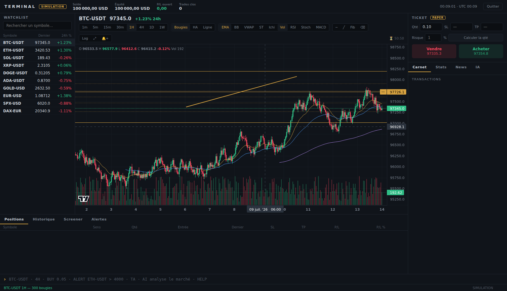

# Terminal — poste de trading multi-courtiers

Terminal web professionnel (non officiel) : données de marché temps réel,
graphiques de niveau TradingView, carnet d'ordres, statistiques avancées,
paper trading et analyste IA — le tout **sans backend** : le navigateur parle
directement aux API officielles.



## Courtiers / sources de données

| Source | Données | Trading | Identifiants |
|--------|---------|---------|--------------|
| **OKX — mon compte** | Compte réel : soldes, positions, historique complet + **poste d'analyse** | Aucun (lecture seule) | Clé API OKX **permission « Lire » uniquement** |
| **OKX — public** | Crypto spot temps réel (WebSocket public, repli REST auto) | Paper trading (100 000 USDT fictifs, prix réels) | Aucun |
| **XTB** | CFD Forex / indices / matières premières (xAPI) | **Réel** sur votre compte démo ou réel | N° de compte + mot de passe xStation |
| **Simulation** | Marche aléatoire locale | Paper trading | Aucun |

## Poste d'analyse du compte OKX

Touche **F2** (ou le bouton *Analyse*). Sept vues, toutes filtrables par période,
produit, instrument, sens et résultat depuis **une seule ligne de filtres**.

**Vue d'ensemble** — résultat net cumulé en figure principale, tuiles clés
(trades, réussite, profit factor, espérance, drawdown, frais), **courbe de
capital** et **drawdown** (moteur TradingView, échelles de temps synchronisées),
**calendrier** des résultats par jour et par mois, points saillants.

**Performance** — résultat brut/net, poids des frais et du financement, volume,
rendement sur capital · réussite, payoff, espérance, **SQN**, Kelly, écart-type ·
drawdown max et actuel, durée sous l'eau, recovery factor, **Ulcer index**,
**Sharpe / Sortino / Calmar**, volatilité annualisée · extrêmes, médiane,
percentiles, séries de gains et de pertes · distribution des résultats · résultat mensuel.

**Trades** — journal complet triable : entrée, sortie, levier, notionnel, durée,
frais, rendement sur marge, type de clôture (liquidations signalées). Export CSV.
Bouton *Graphique* : bascule vers le terminal, charge l'instrument à l'unité de
temps adaptée et **recentre la vue sur le trade**.

**Répartition** — par instrument, sens, produit, **heure d'entrée**, jour de la
semaine, **durée de détention**, **levier** et quartile de taille de position.

**Comportement** — constats chiffrés comparant un sous-ensemble de vos trades au
reste de votre activité : trades de revanche (< 30 min après une perte), trades
pris après deux pertes d'affilée, journées de surtrading, pertes gardées plus
longtemps que les gains, poids des frais, liquidations, régularité des tailles,
instrument le plus coûteux, trading nocturne.

**Compte** — équité, soldes par devise, positions ouvertes avec P/L latent, prix
de liquidation, marge et financement, dépôts et retraits cumulés, état des
données chargées.

**Coach IA** — bilan automatique local (sans clé), puis analyse par Claude sur
demande : bilan de coaching, audit de risque, recherche d'avantage statistique,
trois corrections prioritaires. Seules les **statistiques agrégées** et les 40
derniers trades sont transmis — jamais la clé OKX.

### Sources de données et limites

| Source | Couverture | Remarque |
|--------|-----------|----------|
| `positions-history` | dérivés & marge, **3 mois** | OKX bride à 1 requête / 10 s → synchro **incrémentale**, seuls les nouveaux trades sont retéléchargés |
| `fills-history` (spot) | **3 mois** | le spot n'a pas de « positions » : les allers-retours sont **reconstruits en FIFO** (prix d'entrée = moyenne pondérée des lots consommés) |
| Import **CSV** | illimitée | pour l'historique au-delà de 3 mois — exports OKX « Historique des positions » **ou** « Historique des ordres » ; formats FR et EN, séparateurs `,` `;` tab, décimales à la virgule |

Les deux sources sont **fusionnées et dédoublonnées** (l'API fait autorité sur le
CSV) puis conservées en **IndexedDB** dans votre navigateur. Boutons
*Resynchroniser tout*, *Exporter l'archive (JSON)* et *Effacer l'archive* dans
l'onglet **Compte**.

### Positions passées sur le graphique

Les trades clôturés de l'instrument affiché sont tracés sur le graphique du
terminal : flèche à l'entrée (verte à l'achat, rouge à la vente), cercle à la
sortie coloré selon le résultat, segment pointillé entrée → sortie. Commande
`TRADES` pour afficher / masquer.

### Sécurité de la clé API

- Créez la clé sur okx.com → Paramètres → API en cochant **uniquement « Lire »**.
  Le terminal n'envoie aucun ordre : le ticket est neutralisé dans ce mode.
- La clé est signée en **HMAC-SHA256 dans le navigateur** (WebCrypto) et n'est
  transmise qu'à `okx.com`. Aucun serveur intermédiaire.
- Conservation au choix : **session seule** (effacée à la fermeture de l'onglet)
  ou **chiffrée** sur la machine (AES-GCM 256, clé dérivée par PBKDF2-SHA256,
  250 000 itérations) derrière un mot de passe.
- Une restriction d'IP sur la clé côté OKX reste la protection la plus forte.

## Fonctionnalités

**Graphiques** — moteur [TradingView Lightweight Charts™](https://github.com/tradingview/lightweight-charts)
(open source, Apache-2.0), en **disposition 1 / 2 / 4 graphiques synchronisés**
(chaque cellule son instrument et son unité de temps) : chandeliers /
Heikin-Ashi / ligne, volume, EMA 20-50-200, Bollinger, VWAP session,
**SuperTrend, Ichimoku**, RSI, **Stochastique** et MACD en sous-panneaux,
échelle log, axe en heure locale, zoom/pan fluides, crosshair avec légende
OHLC, lignes de prix positions (entrée/SL/TP) et alertes. **Outils de dessin**
(horizontale, tendance, Fibonacci) persistés par instrument. Chargement
infini de l'historique. Bandeau **marché global** (cap., dominance BTC/ETH).

**Marché** — carnet d'ordres 5 niveaux avec barres de profondeur, flux des
transactions, statistiques : variation/volumes 24h, **funding rate, open
interest, prix d'index** (dérivés OKX), ATR 14, volatilité par bougie,
spread/swap/levier (CFD XTB). Recherche instantanée parmi tous les
instruments OKX.

**Trading** — ticket achat/vente au marché avec SL/TP, confirmation
systématique, notionnel affiché. Paper trading exécuté aux prix réels avec
**SL/TP déclenchés automatiquement**, historique persistant et statistiques
de portefeuille (taux de réussite, profit factor, gain/perte moyens).
En mode XTB : ordres réels sur votre compte.

**Alertes de prix** — toast + notification navigateur + ligne sur le
graphique, persistées localement.

**IA** — rapport d'analyse technique local (score composite, verdict,
niveaux pivots — fonctionne sans clé) + chat Claude avec contexte marché
complet (prix, indicateurs, carnet, funding, positions, compte) envoyé
**directement du navigateur** à l'API Anthropic. Boutons : Analyse, Risque,
Plan de trade. Clé stockée en localStorage (`KEY`).

**News** — annonces officielles OKX / flux news XTB selon la source.

## Démarrage

Site statique, aucune dépendance :

```bash
python3 -m http.server 8000   # puis http://localhost:8000
```

ou ouvrez directement la version en ligne, choisissez **OKX** et lancez —
aucun compte requis.

## Ligne de commande (`/` pour focaliser, ↑↓ historique)

| Commande | Effet |
|----------|-------|
| `BTC-USDT` / `ETH-USDT 4H` | sélectionne l'instrument (+ unité de temps) |
| `BUY 0.05` / `SELL 0.05 98000 92000` | ordre au marché (+ SL + TP) |
| `CLOSE 3` / `CLOSE ALL` | clôture une / toutes les positions |
| `ALERT BTC-USDT > 70000` | alerte de prix (`ALERT DEL 1`) |
| `ADD SOL-USDT` / `DEL SOL-USDT` | watchlist |
| `TA` / `AI question…` / `KEY` | analyse technique / chat IA / clé API |
| `ANALYSE` (`F2`) | poste d'analyse — `ANALYSE PERF\|TRADES\|SPLIT\|COMPORTEMENT\|COMPTE\|COACH` |
| `SYNC` / `SYNC ALL` | synchronise l'historique OKX (incrémental / complet) |
| `IMPORT` | importe un export CSV OKX |
| `TRADES` | affiche / masque les positions passées sur le graphique |
| `BOOK` `STATS` `NEWS` `POS` `HIST` | navigation |
| `IND RSI` (EMA BB VWAP VOL RSI MACD) | indicateurs |
| `RESET PAPER` | remet le compte fictif à 100 000 |
| `HELP` | aide |

## Architecture

```
index.html              structure
css/terminal.css        thème sombre sobre (accent doré unique)
js/vendor/              TradingView Lightweight Charts™ v5 (Apache-2.0)
js/indicators.js        SMA EMA RSI MACD Bollinger ATR VWAP Heikin-Ashi + moteur TA
js/chart.js             graphique multi-panneaux (LWC v5) + trades passés
js/paper.js             moteur de paper trading (SL/TP auto, stats)
js/store.js             archive IndexedDB + coffre à clés (AES-GCM / PBKDF2)
js/okx-private.js       API privée OKX signée (HMAC WebCrypto) + compte réel
js/trades.js            normalisation des trades, FIFO spot, import CSV
js/analytics.js         moteur de statistiques (pur, sans DOM)
js/analysis.js          poste d'analyse : 7 vues, graphiques, coach IA
js/providers/okx.js     OKX v5 public : WS temps réel + repli REST
js/providers/xtb.js     XTB xAPI : données + compte + ordres réels
js/providers/sim.js     simulation hors-ligne
js/xapi.js              client bas niveau xAPI XTB
js/ai.js                rapport TA + chat Claude (API Anthropic côté navigateur)
js/app.js               orchestration
```

## Avertissements

- Projet indépendant, non affilié à OKX, XTB, TradingView ni Bloomberg.
- Le paper trading est fictif. En mode **XTB réel**, les ordres sont réels.
- Les produits à effet de levier comportent un risque élevé de perte rapide
  en capital. Ceci n'est pas un conseil en investissement.
